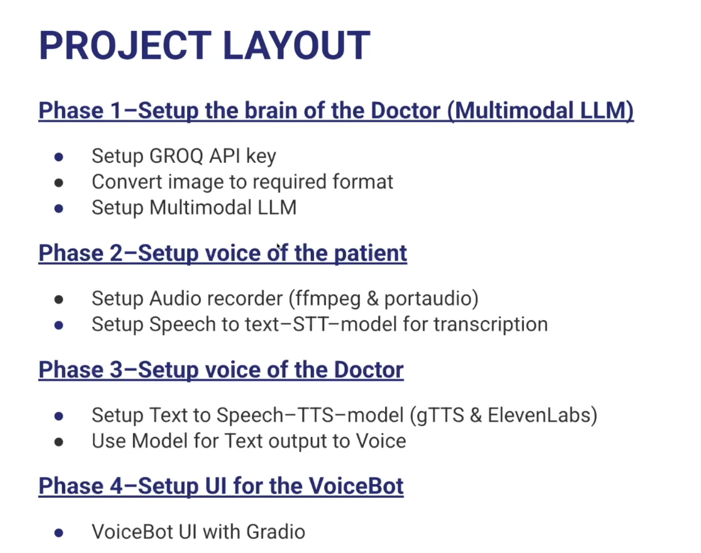
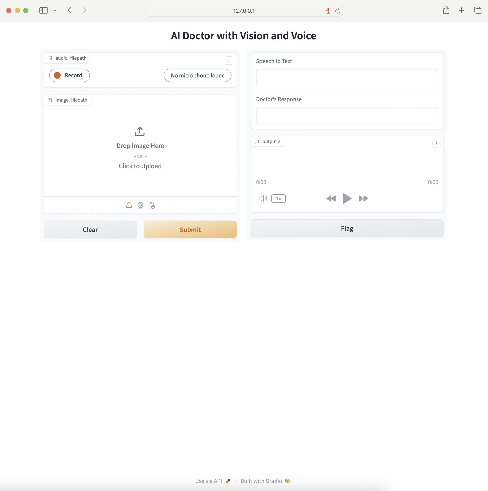

# 🩺 Multimodal Medical AI VoiceBot

> An interactive doctor assistant that listens, sees, reasons, and speaks—built with Gradio, Groq Whisper, a multimodal LLM, and TTS

<p align="center">
  
</p>

---

## 📋 Table of Contents

1. [🚀 Project Overview](#project-overview)  
2. [🎯 Key Features](#key-features)  
3. [🔧 Tech Stack](#tech-stack)  
4. [🛠 Project Phases](#project-phases)  
5. [⚙️ Quickstart](#quickstart)  
6. [📂 Repo Structure](#repo-structure)   
7. [🗺️ Roadmap](#roadmap)  
. [⚖️ Disclaimer](#disclaimer)  

---

## 🚀 Project Overview

**Multimodal Medical AI VoiceBot** is a proof‑of‑concept assistant that:

- 🎤 **Listens** to patient voice queries via microphone  
- 🖼️ **Analyzes** medical images (e.g., X‑rays, skin lesions)  
- 💬 **Converts** speech → text (Groq Whisper)  
- 🧠 **Reasons** with a multimodal LLM (Meta‑LLaMA Scout)  
- 🔊 **Speaks** back advice using TTS (gTTS)  
- 🖥️ **Runs** in-browser via a Gradio interface  

<p align="center">
  
</p>

---

## 🎯 Key Features

- **🔊 Live Audio Input**: Record and upload patient questions  
- **🖼️ Image Support**: Diagnose from uploaded scans or photos  
- **📝 Accurate Transcription**: Groq Whisper (whisper-large-v3)  
- **🤖 Medical Reasoning**: Custom system prompt for concise responses  
- **🎙️ High‑Quality TTS**: gTTS for natural voice output  
- **🖥️ User‑Friendly UI**: One‑click record, upload, and chat  

---

## 🔧 Tech Stack

| Layer                | Technology                          |
|----------------------|-------------------------------------|
| **Frontend / UI**    | Gradio                              |
| **Speech‑to‑Text**   | Groq Whisper API                    |
| **Vision**           | llama-4-scout-17b-16e-instruct      |
| **LLM Orchestration**| Python, Prompt Engineering          |
| **Text‑to‑Speech**   | gTTS                  |
| **Environment**      | Python 3.9, Pipenv, `.env`          |
| **Deployment**       | Local / Gradio share link           |

---

## 🛠 Project Phases

1. **Phase 1 – Brain of the Doctor**  
   - Configure Groq API & Whisper  
   - Setup multimodal LLM for Q&A  
   - Design concise medical system prompt  

2. **Phase 2 – Voice of the Patient**  
   - Implement browser audio recorder (Gradio Audio widget)  
   - Transmit mic input → `.wav` → Whisper API  

3. **Phase 3 – Voice of the Doctor**  
   - Integrate gTTS  
   - Save and return `.mp3` for playback  

4. **Phase 4 – UI for the VoiceBot**  
   - Build Gradio interface with audio + image inputs  
   - Display chat history and real‑time audio responses  

---

## ⚙️ Quickstart

```bash
git clone https://github.com/ifte1/Multimodal-Medical-AI-VoiceBot.git
cd Multimodal-Medical-AI-VoiceBot

# Install & activate
pipenv install
pipenv shell

# Configure environment
# Add GROQ_API_KEY

# Run the app
pipenv run python gradio_app.py
# or, for FastAPI/uvicorn:
# pipenv run uvicorn gradio_app:app --reload --port 7860

---
## 📂 Repo Structure

    medical-voicebot/
    ├── assets/  
    │   ├── Project_layout.png  
    │   └── screenshot_ui.png  
    ├── doctor_brain.py        # Vision + LLM logic  
    ├── patient_voice.py       # Audio recorder + STT wrapper  
    ├── doctor_voice.py        # TTS wrapper  
    ├── gradio_app.py          # Main interface  
    ├── Pipfile / Pipfile.lock   
    └── README.md

---

## 🗺️ Roadmap

- [ ] Add PDF summarization & automatic reports  
- [ ] Integrate medical history retrieval using FAISS  
- [ ] Improve TTS voice with ElevenLabs Pro  
- [ ] Deploy on Streamlit Cloud or Hugging Face Spaces  
- [ ] Add chat memory and patient profile storage  
- [ ] Add multilingual support for global use  

---

## ⚖️ Disclaimer

**educational and demonstration purposes only**.  
**Do not use this application for real-world medical diagnosis or treatment.**

Always consult a licensed healthcare professional for any medical advice or diagnosis.

---
